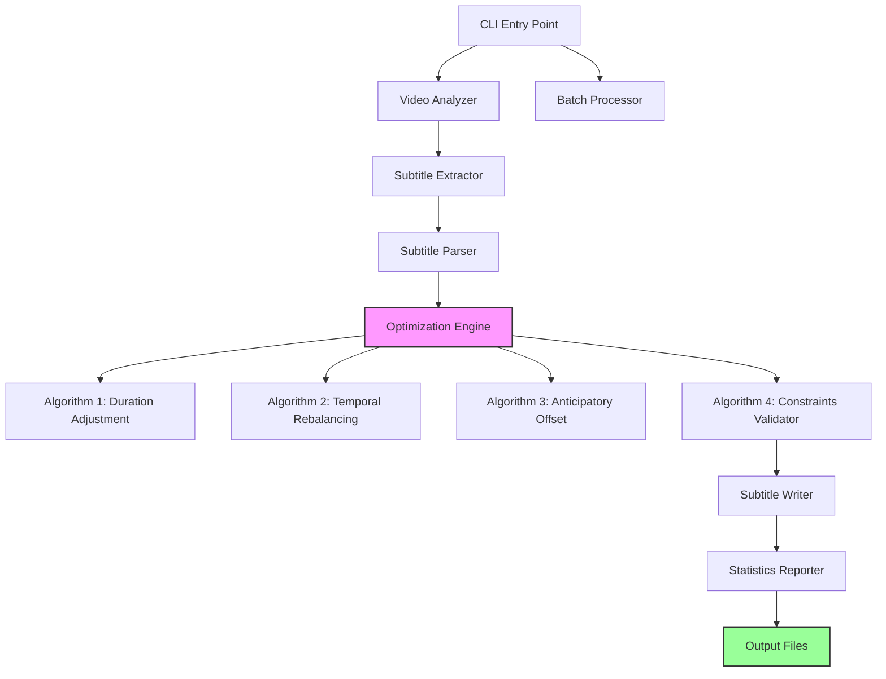
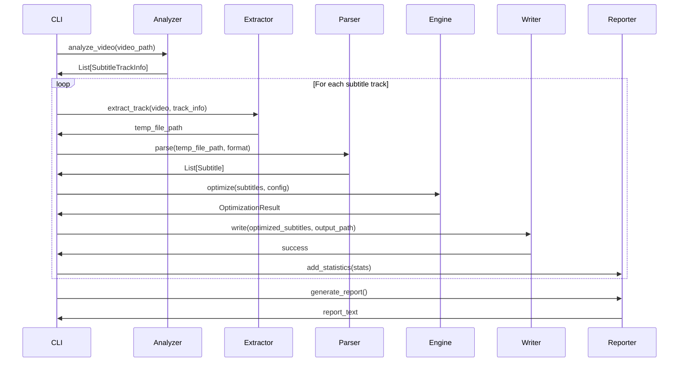

# SubTuner - Subtitle Optimization Tool Architecture

## Project Overview

SubTuner is a Python CLI tool that extracts, analyzes, and optimizes embedded subtitle tracks from video files (MKV, MP4) to improve readability while preserving semantic segmentation.

## Core Requirements

### Functional Requirements
1. Extract text subtitle tracks (SRT, VTT, ASS) from video files
2. Apply four optimization algorithms with configurable parameters:
   - Duration adjustment based on reading speed (20 chars/sec)
   - Temporal rebalancing between consecutive subtitles
   - Conditional anticipatory offset (up to 0.5s earlier)
   - Strict temporal constraints validation
3. Export optimized subtitles as separate files with preserved metadata
4. Support batch processing and dry-run mode
5. Provide detailed statistics on applied modifications

### Non-Functional Requirements
- Robust error handling for corrupted files and encoding issues
- Performance: Process typical movie (2h, ~1500 subtitles) in <10 seconds
- Memory efficient: Stream processing for large subtitle files
- Cross-platform compatibility (Windows, Linux, macOS)

## System Architecture

### High-Level Architecture



### Component Breakdown

#### 1. CLI Interface (`cli.py`)
**Responsibilities:**
- Parse command-line arguments
- Validate input parameters
- Initialize logging and configuration
- Coordinate workflow execution

**Key Classes:**
- `SubTunerCLI`: Main CLI handler

**Arguments:**
```
subtuner [OPTIONS] VIDEO_PATH [VIDEO_PATH...]

Options:
  --chars-per-sec FLOAT        Reading speed (default: 20.0)
  --max-duration FLOAT         Max subtitle duration (default: 8.0s)
  --min-duration FLOAT         Min subtitle duration (default: 1.0s)
  --min-gap FLOAT              Min gap between subtitles (default: 0.05s)
  --anticipation FLOAT         Max anticipation offset (default: 0.5s)
  --rebalance-threshold FLOAT  Short/long threshold (default: 0.8s/3.0s)
  --dry-run                    Preview without writing files
  --batch                      Process multiple videos
  --output-dir PATH            Output directory (default: same as input)
  --verbose / --quiet          Verbosity level
  --version                    Show version
```

#### 2. Video Analyzer (`video/analyzer.py`)
**Responsibilities:**
- Probe video file metadata using FFprobe
- Detect subtitle tracks and their properties
- Validate video file integrity

**Key Classes:**
- `VideoAnalyzer`: FFprobe wrapper
- `SubtitleTrackInfo`: Dataclass for track metadata

**Properties Extracted:**
```python
@dataclass
class SubtitleTrackInfo:
    index: int
    codec: str  # srt, ass, subrip, webvtt
    language: Optional[str]
    title: Optional[str]
    default: bool
    forced: bool
```

#### 3. Subtitle Extractor (`extraction/extractor.py`)
**Responsibilities:**
- Extract subtitle tracks using FFmpeg
- Handle temporary file management
- Convert formats if needed

**Key Classes:**
- `SubtitleExtractor`: FFmpeg wrapper for extraction
- `TempFileManager`: Context manager for temp files

#### 4. Subtitle Parser (`parsers/`)
**Responsibilities:**
- Parse different subtitle formats
- Normalize to internal representation
- Preserve format-specific metadata

**Structure:**
```
parsers/
  __init__.py
  base.py           # AbstractParser base class
  srt_parser.py     # SRT format parser
  vtt_parser.py     # WebVTT format parser
  ass_parser.py     # ASS/SSA format parser
```

**Key Classes:**
- `AbstractParser`: Base class defining interface
- `SRTParser`: Uses pysrt library
- `VTTParser`: Custom implementation or webvtt-py
- `ASSParser`: Uses ass library

**Internal Representation:**
```python
@dataclass
class Subtitle:
    index: int
    start_time: float  # seconds
    end_time: float    # seconds
    text: str
    metadata: Dict[str, Any]  # Format-specific data
    
    @property
    def duration(self) -> float:
        return self.end_time - self.start_time
    
    @property
    def char_count(self) -> int:
        return len(self.text)
```

#### 5. Optimization Engine (`optimization/`)
**Responsibilities:**
- Coordinate optimization algorithms
- Apply algorithms in correct order
- Track modifications for statistics

**Structure:**
```
optimization/
  __init__.py
  engine.py                 # Main optimization coordinator
  algorithms/
    __init__.py
    duration_adjuster.py    # Algorithm 1
    rebalancer.py           # Algorithm 2
    anticipator.py          # Algorithm 3
    validator.py            # Algorithm 4
  config.py                 # OptimizationConfig dataclass
```

**Algorithm Pipeline:**
```python
class OptimizationEngine:
    def optimize(self, subtitles: List[Subtitle], config: OptimizationConfig) -> OptimizationResult:
        # 1. Duration adjustment
        # 2. Temporal rebalancing
        # 3. Anticipatory offset
        # 4. Constraints validation
        # 5. Statistics collection
```

#### 6. Optimization Algorithms

##### Algorithm 1: Duration Adjustment (`algorithms/duration_adjuster.py`)
**Logic:**
```python
def calculate_target_duration(subtitle: Subtitle, chars_per_sec: float, 
                             min_dur: float, max_dur: float) -> float:
    """
    Target duration = char_count / chars_per_sec
    Clamped to [min_dur, max_dur]
    """
    target = subtitle.char_count / chars_per_sec
    return max(min_dur, min(max_dur, target))

def adjust_duration(subtitle: Subtitle, next_subtitle: Optional[Subtitle],
                   config: OptimizationConfig) -> Tuple[Subtitle, ModificationStats]:
    """
    Extend end_time up to target duration without overlapping next subtitle
    """
```

##### Algorithm 2: Temporal Rebalancing (`algorithms/rebalancer.py`)
**Logic:**
```python
def should_rebalance(current: Subtitle, next: Subtitle, 
                    short_threshold: float, long_threshold: float) -> bool:
    """
    Returns True if current is short (<0.8s) and next is long (>3s)
    """

def rebalance_pair(current: Subtitle, next: Subtitle,
                  min_gap: float) -> Tuple[Subtitle, Subtitle, float]:
    """
    Transfer time from next to current while maintaining min_gap
    Returns modified subtitles and amount transferred
    """
```

##### Algorithm 3: Anticipatory Offset (`algorithms/anticipator.py`)
**Logic:**
```python
def calculate_anticipation(current: Subtitle, previous: Optional[Subtitle],
                          max_anticipation: float, min_gap: float) -> float:
    """
    Calculate how much earlier current can start:
    - Up to max_anticipation (0.5s)
    - Must maintain min_gap from previous
    - Only if increases duration
    """

def apply_anticipation(subtitle: Subtitle, anticipation: float) -> Subtitle:
    """
    Shift start_time earlier by anticipation amount
    """
```

##### Algorithm 4: Constraints Validator (`algorithms/validator.py`)
**Logic:**
```python
def validate_and_fix(subtitles: List[Subtitle], 
                    config: OptimizationConfig) -> List[Subtitle]:
    """
    Enforce hard constraints:
    - Minimum display time: 1.0s
    - Minimum gap: 0.05s
    - No overlaps
    - Chronological order
    """
```

#### 7. Subtitle Writer (`writers/`)
**Responsibilities:**
- Write optimized subtitles back to files
- Preserve original format and styles
- Maintain metadata and encoding

**Structure:**
```
writers/
  __init__.py
  base.py           # AbstractWriter base class
  srt_writer.py
  vtt_writer.py
  ass_writer.py
```

#### 8. Statistics Reporter (`statistics/reporter.py`)
**Responsibilities:**
- Collect modification statistics
- Generate human-readable reports
- Support different output formats (console, JSON)

**Statistics Tracked:**
```python
@dataclass
class OptimizationStatistics:
    track_index: int
    original_subtitle_count: int
    
    # Duration adjustments
    duration_adjustments: int
    avg_duration_change: float
    
    # Rebalancing
    rebalanced_pairs: int
    total_time_transferred: float
    
    # Anticipation
    anticipated_subtitles: int
    avg_anticipation: float
    
    # Validation fixes
    min_duration_fixes: int
    gap_fixes: int
    
    # Overall metrics
    processing_time: float
    total_modifications: int
```

#### 9. Batch Processor (`batch/processor.py`)
**Responsibilities:**
- Process multiple videos in sequence
- Aggregate statistics
- Handle per-file errors gracefully

#### 10. Error Handling (`errors.py`)
**Custom Exceptions:**
```python
class SubTunerError(Exception): pass
class VideoAnalysisError(SubTunerError): pass
class SubtitleExtractionError(SubTunerError): pass
class ParsingError(SubTunerError): pass
class OptimizationError(SubTunerError): pass
class WritingError(SubTunerError): pass
```

## Data Flow

### Single Video Processing Flow



## Project Structure

```
subtuner/
├── subtuner/
│   ├── __init__.py
│   ├── __main__.py          # Entry point
│   ├── cli.py               # CLI interface
│   ├── errors.py            # Custom exceptions
│   ├── config.py            # Global configuration
│   │
│   ├── video/
│   │   ├── __init__.py
│   │   └── analyzer.py      # FFprobe wrapper
│   │
│   ├── extraction/
│   │   ├── __init__.py
│   │   └── extractor.py     # FFmpeg extraction
│   │
│   ├── parsers/
│   │   ├── __init__.py
│   │   ├── base.py
│   │   ├── srt_parser.py
│   │   ├── vtt_parser.py
│   │   └── ass_parser.py
│   │
│   ├── optimization/
│   │   ├── __init__.py
│   │   ├── engine.py
│   │   ├── config.py
│   │   └── algorithms/
│   │       ├── __init__.py
│   │       ├── duration_adjuster.py
│   │       ├── rebalancer.py
│   │       ├── anticipator.py
│   │       └── validator.py
│   │
│   ├── writers/
│   │   ├── __init__.py
│   │   ├── base.py
│   │   ├── srt_writer.py
│   │   ├── vtt_writer.py
│   │   └── ass_writer.py
│   │
│   ├── statistics/
│   │   ├── __init__.py
│   │   └── reporter.py
│   │
│   └── batch/
│       ├── __init__.py
│       └── processor.py
│
├── tests/
│   ├── __init__.py
│   ├── conftest.py          # Pytest fixtures
│   ├── test_parsers.py
│   ├── test_optimization.py
│   ├── test_algorithms.py
│   ├── test_writers.py
│   ├── test_cli.py
│   └── fixtures/            # Test subtitle files
│
├── docs/
│   ├── README.md
│   ├── USAGE.md
│   └── ALGORITHMS.md
│
├── .gitignore
├── pyproject.toml           # Poetry configuration
├── setup.py
├── requirements.txt
├── requirements-dev.txt
└── ARCHITECTURE.md          # This file
```

## Dependencies

### Core Dependencies
```toml
[tool.poetry.dependencies]
python = "^3.8"
click = "^8.1"              # CLI framework
pysrt = "^1.1"              # SRT parsing
webvtt-py = "^0.4"          # VTT parsing
ass = "^0.5"                # ASS/SSA parsing
```

### External Tools
- **FFmpeg** (required): Video processing and subtitle extraction
- **FFprobe** (required): Video analysis

### Development Dependencies
```toml
[tool.poetry.dev-dependencies]
pytest = "^7.4"
pytest-cov = "^4.1"
black = "^23.3"
mypy = "^1.4"
flake8 = "^6.0"
```

## Algorithm Details

### Algorithm Parameters

| Parameter | Default | Range | Description |
|-----------|---------|-------|-------------|
| `chars_per_sec` | 20.0 | 10-40 | Reading speed in characters per second |
| `max_duration` | 8.0 | 3-15 | Maximum subtitle display time (seconds) |
| `min_duration` | 1.0 | 0.5-2 | Minimum subtitle display time (seconds) |
| `min_gap` | 0.05 | 0.01-0.2 | Minimum gap between subtitles (seconds) |
| `max_anticipation` | 0.5 | 0-1 | Maximum anticipatory offset (seconds) |
| `short_threshold` | 0.8 | 0.5-1.5 | Threshold for "short" subtitle (seconds) |
| `long_threshold` | 3.0 | 2-6 | Threshold for "long" subtitle (seconds) |

### Algorithm Execution Order

1. **Duration Adjustment** - Establish target durations
2. **Temporal Rebalancing** - Balance short/long pairs
3. **Anticipatory Offset** - Start subtitles earlier when beneficial
4. **Constraints Validation** - Enforce hard constraints

This order ensures that:
- Durations are optimized first
- Rebalancing works with optimized durations
- Anticipation has more flexibility after rebalancing
- Final validation catches any edge cases

## Performance Considerations

### Optimization Strategies
1. **Stream Processing**: Process subtitles sequentially to minimize memory
2. **Lazy Evaluation**: Only parse formats when needed
3. **Caching**: Cache FFprobe results for repeated queries
4. **Parallel Processing**: Process multiple tracks concurrently (optional)

### Expected Performance
- **Small video** (30min, ~400 subtitles): <2 seconds
- **Medium video** (2h, ~1500 subtitles): <10 seconds
- **Large video** (3h, ~2500 subtitles): <20 seconds

## Error Handling Strategy

### Error Categories
1. **Input Errors**: Invalid paths, unsupported formats → Exit with error code 1
2. **Extraction Errors**: FFmpeg failures → Skip track, continue processing
3. **Parsing Errors**: Malformed subtitles → Skip problematic entries, log warning
4. **Optimization Errors**: Algorithm failures → Fallback to original, log error
5. **Writing Errors**: I/O failures → Exit with error code 2

### Logging Levels
- **DEBUG**: Algorithm details, timing information
- **INFO**: Processing progress, statistics
- **WARNING**: Skipped subtitles, fallbacks
- **ERROR**: Critical failures, exceptions

## Testing Strategy

### Unit Tests
- Each parser with various malformed inputs
- Each optimization algorithm with edge cases
- Configuration validation
- Statistics calculation

### Integration Tests
- End-to-end processing with sample videos
- Batch processing scenarios
- Error handling paths
- Dry-run mode verification

### Test Coverage Target
- Minimum 80% code coverage
- 100% coverage for optimization algorithms

## Future Enhancements (Out of Scope)

1. **Language Detection**: Apply language-specific reading speeds
2. **Machine Learning**: Learn optimal parameters from user feedback
3. **Re-muxing**: Optionally embed optimized subtitles back into video
4. **GUI**: Desktop application with visual timeline editor
5. **Cloud Processing**: Web service for subtitle optimization
6. **Audio Analysis**: Use speech detection to optimize timing further
7. **Format Conversion**: Convert between subtitle formats

## Configuration File Support

Future versions may support a `.subtuner.json` configuration file:

```json
{
  "defaults": {
    "chars_per_sec": 20.0,
    "max_duration": 8.0,
    "min_duration": 1.0,
    "min_gap": 0.05,
    "max_anticipation": 0.5
  },
  "output": {
    "directory": "./optimized",
    "naming_pattern": "{basename}.{track_index}.optimized.{ext}"
  },
  "batch": {
    "recursive": true,
    "file_patterns": ["*.mkv", "*.mp4"]
  }
}
```

## Security Considerations

1. **Input Validation**: Sanitize all file paths
2. **Resource Limits**: Cap maximum file size and processing time
3. **Temp Files**: Secure cleanup of temporary files
4. **Dependency Scanning**: Regular security audits of dependencies

## Conclusion

This architecture provides a modular, extensible foundation for the SubTuner subtitle optimization tool. The design prioritizes:
- **Separation of concerns**: Each module has a clear responsibility
- **Testability**: Easy to unit test individual components
- **Extensibility**: New formats and algorithms can be added easily
- **Maintainability**: Clear structure and documentation
- **Performance**: Efficient processing for large files
- **Reliability**: Comprehensive error handling

The implementation should follow this architecture while remaining flexible to accommodate real-world requirements discovered during development.